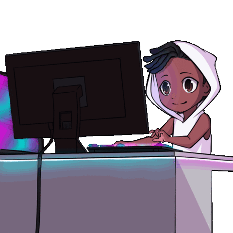

<!-- MasterHead -->

 

  <table border="0">
    <tr>
      <td>
        <!-- Profile Views -->
        
      </td>
      <td>
        <!-- Total Stars -->
        
      </td>
      <td>
        <!-- Followers -->
        
      </td>
    </tr>
  </table>

 

<!-- About Me Section -->
<table align="center" border="0">
  <tr>
    <td align="center" valign="top" width="300">
      
    </td>
    <td align="left" valign="top">
      <h3>💫 About Me</h3>
      

        🎓 I am currently pursuing <b>B.Tech in Computer Science</b> at Mar Baselios College of Engineering and Technology, Trivandrum. 
        💻 I am a passionate <b>Fullstack Developer</b> highly enthusiastic about AI and Machine Learning. 
        🤝 I possess strong <b>leadership qualities</b> and enjoy taking charge to deliver projects. 
        ⚡ I am continuously pushing my boundaries in Natural Language Processing, Computer Vision, and modern Web Tech. 
      

       
      <h3>🧲 Drop me a line:</h3>
      
      
      
    </td>
  </tr>
</table>

 
 

<!-- Languages & Tools -->

  <h3 align="center">📚 Languages & Tools I Have Placed My Hands On</h3>
   
   
   
   

 

<!-- Tech Stack -->

  <h3 align="center">💻 AI & ML Tech Stack</h3>
  
  
  
  
  
  
  

 
 

<!-- Ending -->

  <!-- Replaced with your provided GIF -->
  
   
  
  
  

    ⚠️ This README is designed by <strong>@Hussainbinsalim</strong>.
  

## Hi there 👋

<!--
**Hussainbinsalim/Hussainbinsalim** is a ✨ _special_ ✨ repository because its `README.md` (this file) appears on your GitHub profile.

Here are some ideas to get you started:

- 🔭 I’m currently working on ...
- 🌱 I’m currently learning ...
- 👯 I’m looking to collaborate on ...
- 🤔 I’m looking for help with ...
- 💬 Ask me about ...
- 📫 How to reach me: ...
- 😄 Pronouns: ...
- ⚡ Fun fact: ...
-->
